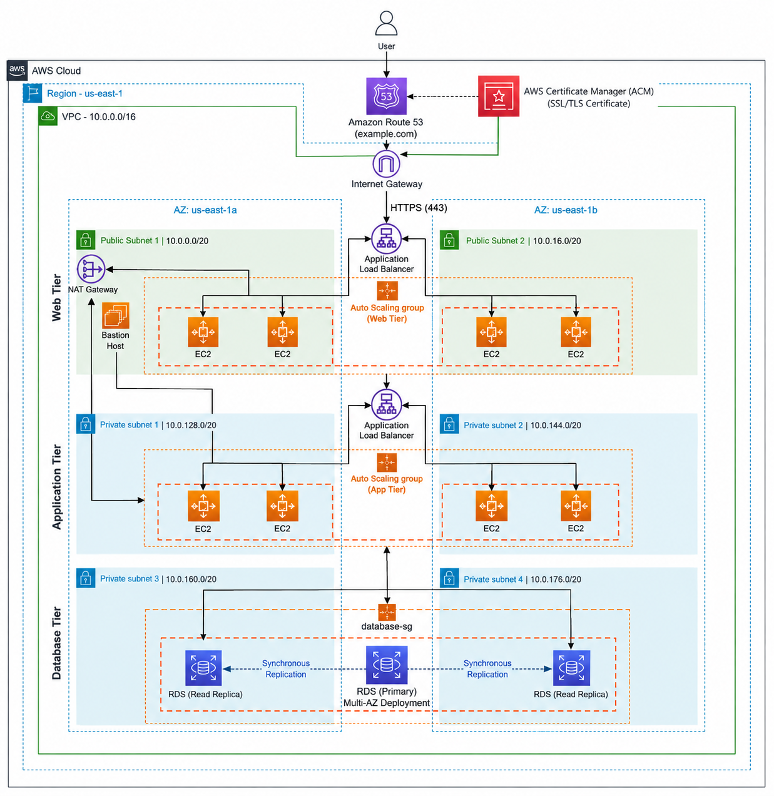
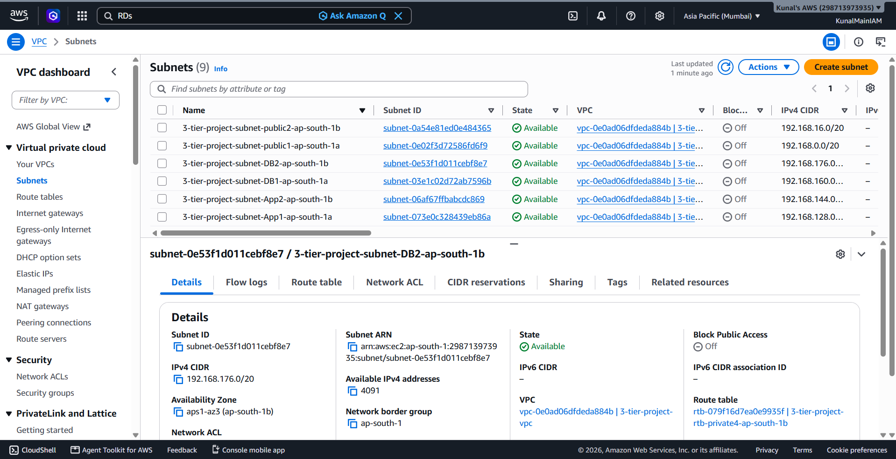
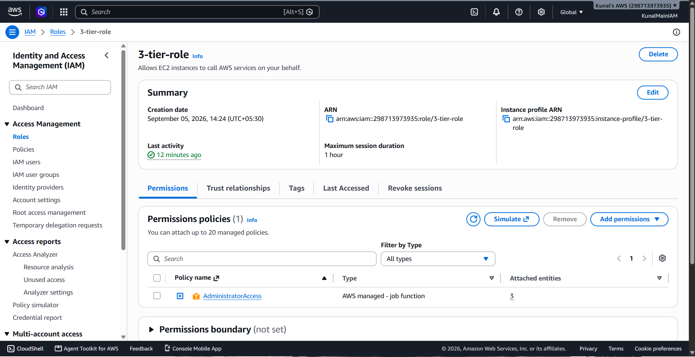
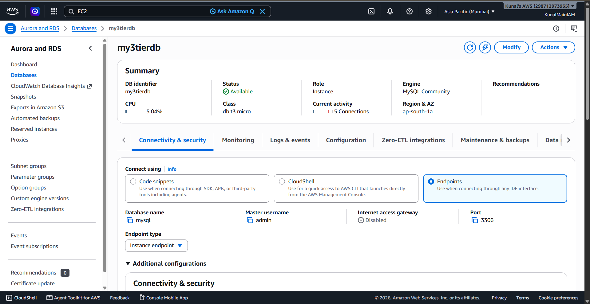
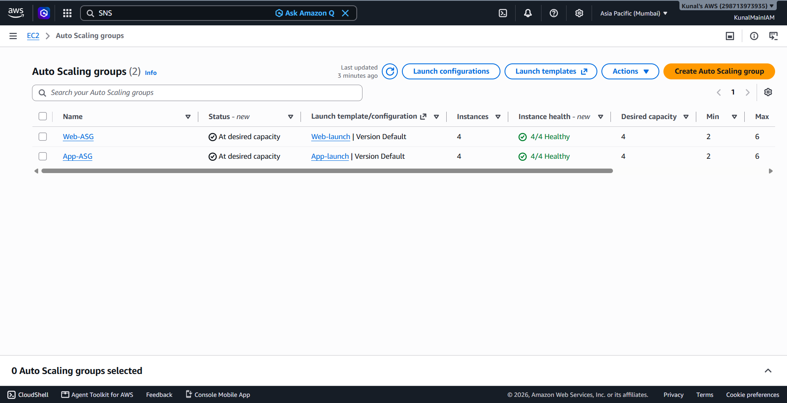
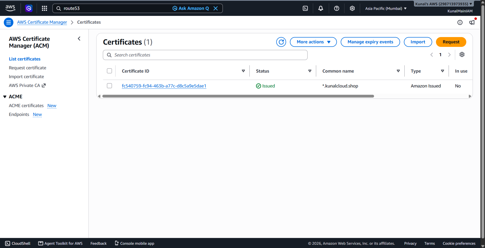
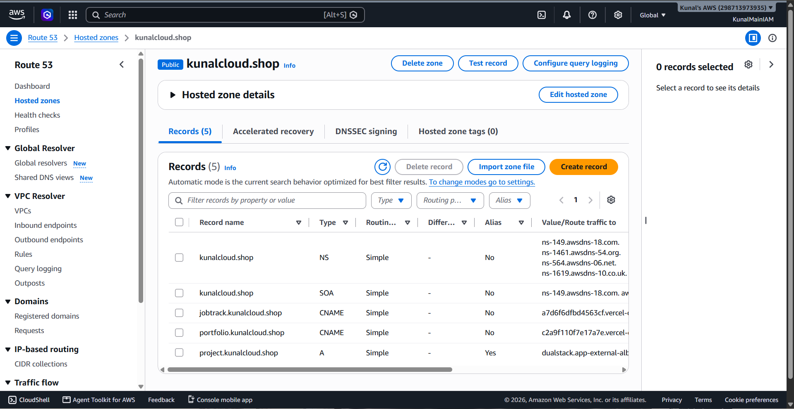
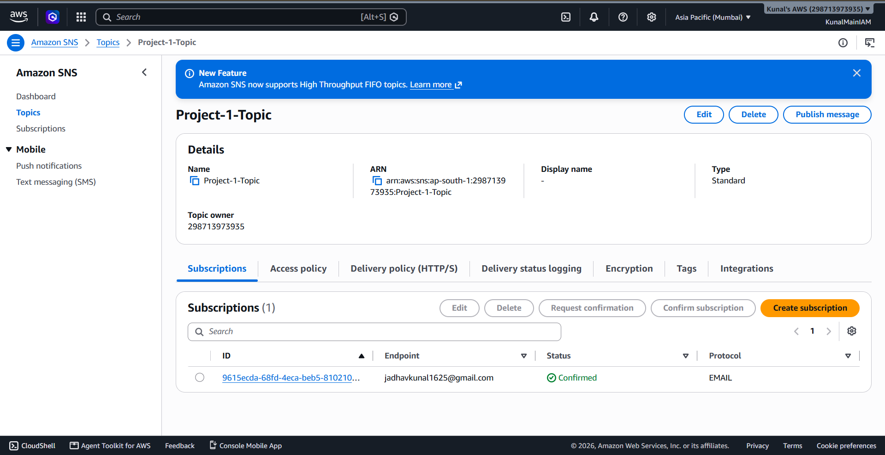
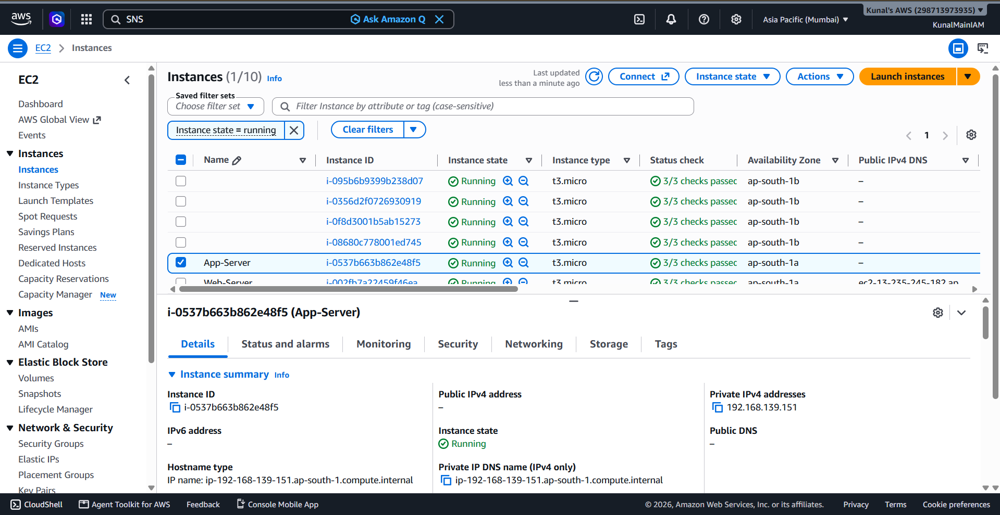
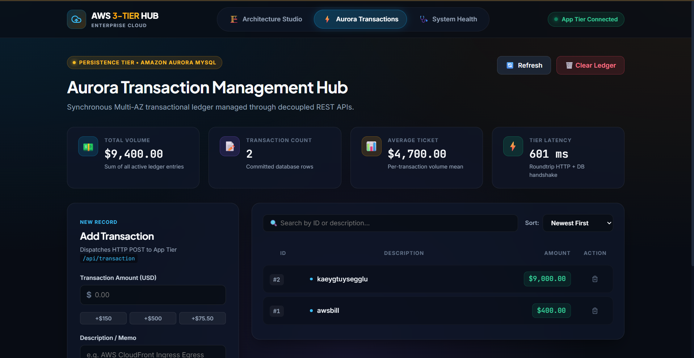

# 🚀 High-Availability 3-Tier Web Application Architecture on AWS

[](https://aws.amazon.com/)
[](https://aws.amazon.com/vpc/)
[](https://aws.amazon.com/ec2/)
[](https://aws.amazon.com/rds/)
[](https://aws.amazon.com/elasticloadbalancing/)
[](https://aws.amazon.com/autoscaling/)
[](https://aws.amazon.com/route53/)
[](https://aws.amazon.com/certificate-manager/)
[](https://nodejs.org/)
[](https://react.dev/)
[](https://nginx.org/)

---

## 📌 Project Overview

This repository contains the end-to-end implementation and deployment architecture for a **production-ready, fault-tolerant, scalable, and secure 3-Tier Web Application deployed on Amazon Web Services (AWS)** across multiple Availability Zones in the **ap-south-1 (Mumbai)** region.

The application decouples the presentation, logic, and data layers into isolated network tiers, adhering to the **AWS Well-Architected Framework** for security, high availability, and operational excellence.

---

## 🏗 Architecture Overview

```
                                    ┌────────────────────────┐
                                    │    Internet Clients    │
                                    └───────────┬────────────┘
                                                │
                                    ┌───────────▼────────────┐
                                    │     Route 53 / ACM     │
                                    │ project.kunalcloud.shop│
                                    └───────────┬────────────┘
                                                │ HTTPS :443
                                    ┌───────────▼────────────┐
                                    │   External Web ALB     │
                                    └─────┬────────────┬─────┘
                                          │            │
            ┌─────────────────────────────┼────────────┼─────────────────────────────┐
            │                             │            │                             │
    ┌───────▼──────────────────────────┐  │    ┌───────▼──────────────────────────┐  │
    │  Public Subnet 1 (ap-south-1a)   │  │    │  Public Subnet 2 (ap-south-1b)   │  │
    │  ┌─────────────────────────────┐ │  │    │  ┌─────────────────────────────┐ │  │
    │  │ Web Server (React + Nginx)  │ │  │    │  │ Web Server (React + Nginx)  │ │  │
    │  │ [Auto Scaling Group]        │ │  │    │  │ [Auto Scaling Group]        │ │  │
    │  └──────────────┬──────────────┘ │  │    │  └──────────────┬──────────────┘ │  │
    └─────────────────┼────────────────┘  │    └─────────────────┼────────────────┘  │
                      └───────────────────┼──────────────────────┘                   │
                                          │                                          │
                               ┌──────────▼──────────┐                               │
                               │  Internal App ALB   │                               │
                               └────┬─────────────┬──┘                               │
                                    │             │                                  │
    ┌───────────────────────────────┼─────────────┼───────────────────────────────┐  │
    │                               │             │                               │  │
    │  Private App Subnet 1         │             │  Private App Subnet 2         │  │
    │  ┌──────────────────────────┐ │             │  ┌──────────────────────────┐ │  │
    │  │ Node.js Backend (PM2)    │◄┘             └─►│ Node.js Backend (PM2)    │ │  │
    │  │ Port 4000 [App ASG]      │                  │ Port 4000 [App ASG]      │ │  │
    │  └──────────────┬───────────┘                  └──────────┬───────────────┘ │  │
    └─────────────────┼─────────────────────────────────────────┼─────────────────┘  │
                      └─────────────────────┬───────────────────┘                    │
                                            │ MySQL :3306                            │
    ┌───────────────────────────────────────┼─────────────────────────────────────┐  │
    │                                       │                                     │  │
    │  Private DB Subnet 1                  ▼         Private DB Subnet 2         │  │
    │  ┌────────────────────────────────────────────────────────────────────────┐ │  │
    │  │                   Amazon RDS MySQL Multi-AZ Cluster                    │ │  │
    │  └────────────────────────────────────────────────────────────────────────┘ │  │
    └─────────────────────────────────────────────────────────────────────────────┘  │
                                    CUSTOM VPC (192.168.0.0/16)                      │
```



---

## 🏛️ Tier Breakdown

### 1. Presentation Tier (Web Tier)
* **Frontend**: Responsive modern UI built with React.js.
* **Web Server / Reverse Proxy**: Nginx routing static assets and proxying `/api/*` traffic internally to the App Load Balancer.
* **Load Balancer**: Internet-facing Application Load Balancer (ALB) terminating HTTPS/SSL traffic.
* **Scalability**: Web Auto Scaling Group (`Web-ASG`) scaling instances dynamically based on traffic demand.
* **Domain & Security**: Custom domain routing via **Route 53** (`project.kunalcloud.shop`) secured with an **AWS Certificate Manager (ACM)** SSL/TLS certificate.

### 2. Logic Tier (Application Tier)
* **Backend**: Node.js & Express RESTful API running on port `4000`.
* **Process Management**: Managed by **PM2** for background daemonization, automatic restarts, and log management.
* **Internal Load Balancer**: Private Application Load Balancer (`app-internal-alb`) distributing traffic only from the Web Tier to backend instances.
* **Scalability**: App Auto Scaling Group (`App-ASG`) handling backend computing load.
* **Security & Access**: Deployed inside private subnets without public IPs. Managed securely via **AWS Systems Manager (SSM) Session Manager**, removing the need for open SSH ports or Bastion Jump hosts.

### 3. Data Tier (Database Tier)
* **Database Engine**: Amazon RDS MySQL (Community Edition).
* **High Availability**: Multi-AZ deployment across dedicated isolated database subnets (`DB1` and `DB2`).
* **Security**: Public accessibility disabled; only accepts inbound TCP port 3306 traffic originating strictly from the `App-SG` Security Group.

---

## 🔒 Network & Security Architecture

| Security Group | Inbound Rules | Source | Purpose |
|---|---|---|---|
| **WebALB-SG** | HTTP (80), HTTPS (443) | `0.0.0.0/0` (Internet) | Allows public client access |
| **Web-SG** | HTTP (80), HTTPS (443) | `WebALB-SG` | Restricts web instances to traffic from Web ALB |
| **AppALB-SG** | HTTP (80) | `Web-SG` | Internal load balancer accepting traffic only from Web Tier |
| **App-SG** | Custom TCP (4000) | `AppALB-SG` | Allows Node.js application traffic from App ALB |
| **Database-SG** | MySQL TCP (3306) | `App-SG` | Restricts database access strictly to App Tier servers |

---

## 📂 Repository Structure

```tree
├── 3-Tier Architecture Application Steps.txt  # Detailed execution & provisioning steps
├── install.sh                                # Dependency installation automation script
├── nginx.conf                                # Nginx reverse proxy configuration
├── error.txt                                 # Troubleshooting notes & solutions
├── .gitignore                                # Git ignore rules
│
├── app-tier/                                 # Backend Node.js Application
│   ├── DbConfig.js                           # RDS Database connection configuration
│   ├── TransactionService.js                 # Transaction business logic & queries
│   ├── index.js                              # Express app entrypoint & API routes
│   └── package.json                          # Backend dependencies & scripts
│
├── web-tier/                                 # Frontend React Application
│   ├── public/                               # Public assets & index.html
│   ├── src/                                  # React components, state & styles
│   └── package.json                          # Frontend dependencies & build scripts
│
├── archicture-diagram/                       # Architecture visual assets
│   └── archicture-diagram.png                # Full cloud architecture diagram
│
└── screenshots/                              # Visual proof of deployment & services
    ├── 01-vpc-subnets-configuration.png      # VPC Subnet distribution across AZs
    ├── 02-iam-role-ssm-policy.png            # IAM Role for SSM Session Manager
    ├── 03-rds-mysql-database-setup.png       # RDS MySQL instance & private endpoint
    ├── 04-auto-scaling-groups.png            # Web & App Auto Scaling Groups
    ├── 05-acm-ssl-certificate.png            # ACM SSL/TLS certificate validation
    ├── 06-route53-dns-records.png            # Route 53 DNS records & ALB alias
    ├── 07-amazon-sns-alerts.png              # SNS Topic & email subscription
    ├── 08-ec2-running-instances.png          # Fleet of running EC2 instances
    └── 09-live-application-output.png        # Live running 3-Tier web application
```

---

## 🛠️ Step-by-Step Deployment Guide

### Phase 1: Custom VPC & Networking Setup
1. Create a custom VPC with CIDR `192.168.0.0/16`.
2. Configure **6 Subnets** across 2 Availability Zones (`ap-south-1a` and `ap-south-1b`):
   - **Public Subnets (2)**: `public1`, `public2` (Internet Gateway attached).
   - **Private App Subnets (2)**: `APP1`, `APP2` (NAT Gateway routed for outbound updates).
   - **Private DB Subnets (2)**: `DB1`, `DB2` (Completely isolated).
3. Create 5 chained Security Groups (`WebALB-SG`, `Web-SG`, `AppALB-SG`, `App-SG`, `Database-SG`).

### Phase 2: IAM Role & S3 Storage
1. Create an IAM Role (`3-tier-role`) with `AmazonEC2RoleforSSM` / necessary policies for secure EC2 management without open SSH ports.
2. Create an Amazon S3 bucket to store application source code and deployment scripts.

### Phase 3: Amazon RDS MySQL Database Tier
1. Create a DB Subnet Group (`tier-Subnet-Group`) containing `DB1` and `DB2` subnets.
2. Launch a MySQL DB instance (`my3tierdb`) inside the custom VPC with `Public Access = Disabled` and attached to `Database-SG`.
3. Update `app-tier/DbConfig.js` with RDS hostname endpoint, username, and password credentials.

### Phase 4: Application Tier Deployment
1. Launch an Amazon Linux 2023 EC2 instance (`App-Server`) in `APP1` private subnet with `3-tier-role`.
2. Connect securely using **AWS Systems Manager (SSM) Session Manager**.
3. Install MySQL client, Node.js 16 (via NVM), and PM2:
   ```bash
   sudo dnf install -y mariadb105
   # Initialize database table and records
   mysql -h <rds-endpoint> -u admin -p
   ```
4. Deploy the Node.js backend with PM2:
   ```bash
   cd /home/ec2-user/app-tier
   npm install
   pm2 start index.js
   pm2 startup
   ```
5. Create Target Group (`App-TG` on port 4000, health check `/health`).
6. Create an **Internal Application Load Balancer** (`app-internal-alb`) in private subnets routing to `App-TG`.

### Phase 5: Web Tier Deployment
1. Launch an Amazon Linux 2023 EC2 instance (`Web-Server`) in `public1` subnet.
2. Build React frontend and install Nginx:
   ```bash
   cd ~/web-tier
   npm install && npm run build
   sudo dnf install -y nginx
   ```
3. Configure `/etc/nginx/nginx.conf` with the internal ALB DNS name for API reverse proxying:
   ```nginx
   location /api/ {
       proxy_pass http://<internal-app-alb-dns>:80/;
   }
   ```
4. Start and enable Nginx:
   ```bash
   sudo systemctl restart nginx
   sudo chkconfig nginx on
   ```
5. Create Target Group (`Web-TG` on port 80) and deploy an **Internet-Facing ALB** (`app-external-alb`).

### Phase 6: Domain, SSL (ACM), & Route 53
1. Request a public wildcard SSL certificate (`*.kunalcloud.shop`) in **AWS Certificate Manager (ACM)**.
2. Validate domain ownership via DNS records in **Route 53**.
3. Add HTTPS (443) listener to the External ALB with the issued ACM SSL certificate.
4. Create an **A (Alias)** record in Route 53 pointing `project.kunalcloud.shop` to the external ALB.

### Phase 7: Auto Scaling & High Availability
1. Create AMIs from configured `Web-Server` and `App-Server`.
2. Create Launch Templates (`Web-LT`, `App-LT`).
3. Deploy Auto Scaling Groups (`Web-ASG` and `App-ASG`) with target tracking CPU utilization policies across both Availability Zones.
4. Set up Amazon SNS alerts (`Project-1-Topic`) for autoscaling notifications.

---

## 🔧 Troubleshooting & Key Fixes

> [!NOTE]
> **MySQL Client Driver Compatibility**:
> When running Node.js 16+ on Amazon Linux 2023 with MySQL 8.x authentication plugins, the legacy `mysql` driver can trigger authentication handshake errors. Upgraded to `mysql2`:
> ```bash
> npm uninstall mysql
> npm install mysql2
> ```
> Updated `app-tier/TransactionService.js` to require `mysql2`.

---

## 📸 Deployment Verification & Screenshots

### 1. VPC & Subnet Configuration (Multi-AZ)


### 2. IAM Role & SSM Session Manager Access


### 3. Amazon RDS MySQL Database Setup


### 4. Auto Scaling Groups (Web & App Tiers)


### 5. AWS Certificate Manager (ACM) SSL Certificate


### 6. Amazon Route 53 DNS Configuration


### 7. Amazon SNS Notification Subscription


### 8. Running Fleet of EC2 Instances


### 9. Live 3-Tier Application Dashboard


---

## 👨‍💻 Author

**Kunal Jadhav**

* 🌐 **Portfolio**: [portfolio.kunalcloud.shop](https://portfolio.kunalcloud.shop)
* 🐙 **GitHub**: [@devkunaljadhav](https://github.com/devkunaljadhav)
* 💼 **LinkedIn**: [Kunal Jadhav](https://www.linkedin.com/in/devkunaljadhav)
* 📧 **Email**: [kunaljadhav1625@gmail.com](mailto:kunaljadhav1625@gmail.com)

---

## 📜 License

This project is licensed under the MIT License - feel free to use it for learning and demonstration purposes.
